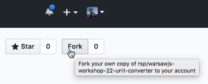

WarsawJS Workshop #22 - Unit Converter Project
=

1. Fork the project on GitHub:



2. Clone your fork:

```sh
git clone git@github.com:YOUR_USERNAME/warsawjs-workshop-22-unit-converter.git
```

3. Enter the project:

```sh
cd warsawjs-workshop-22-unit-converter
```

4. Install dependencies:

```sh
npm i
```

5. Go to the workshop
6. Have fun!
